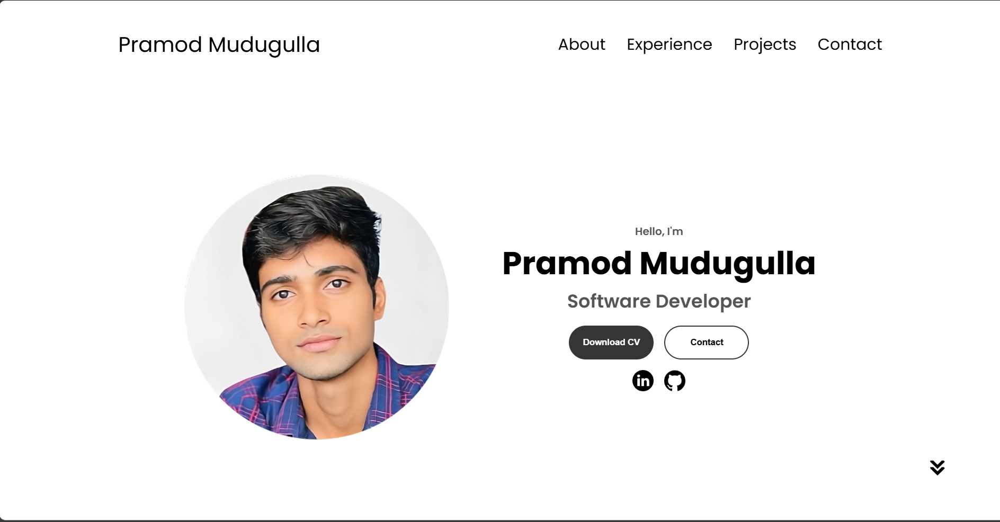
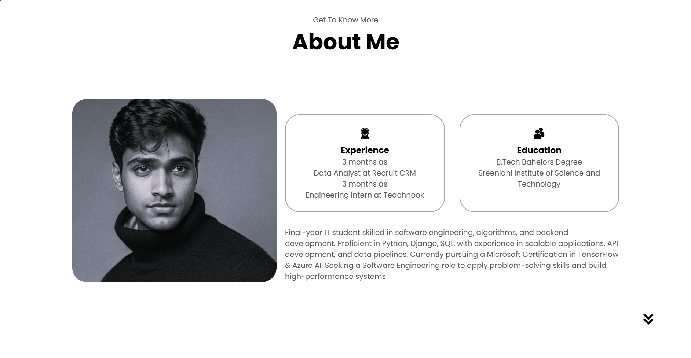
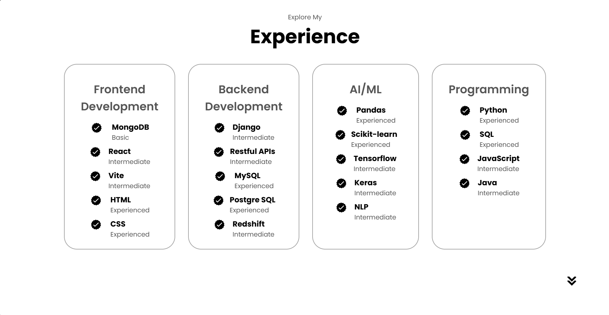
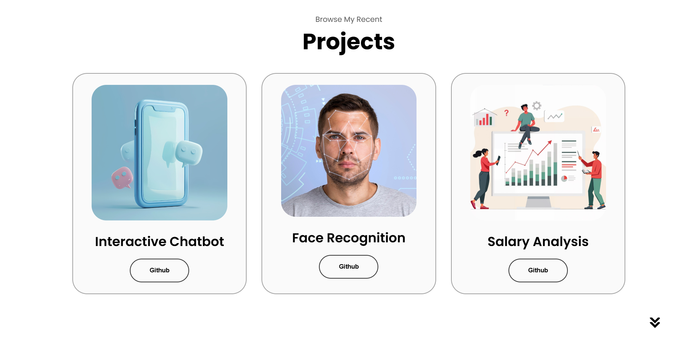
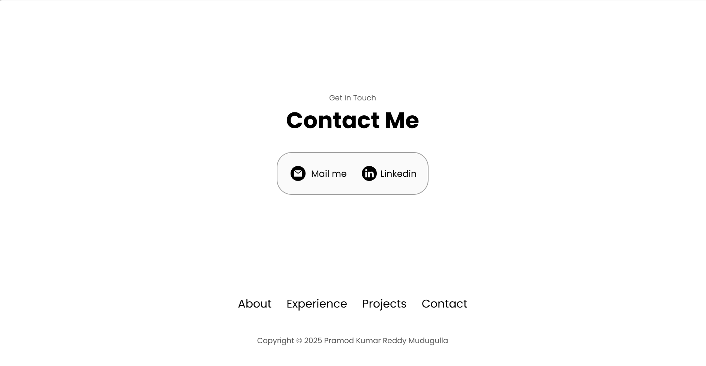

# Portfolio Website

This is a **responsive portfolio website** built using **HTML, CSS, and JavaScript**. It includes sections such as About, Experience, Projects, and Contact. The website is designed with a **hamburger menu for mobile navigation**, smooth scrolling, and interactive UI elements.

## Features
- **Fully responsive** layout using media queries.
- **Hamburger menu** for mobile screens.
- **Smooth scrolling navigation**.
- **Styled buttons, icons, and hover effects**.
- **Profile section with an image and social links**.
- **Experience and Projects sections with well-structured details**.
- **Contact section with clickable email & LinkedIn links**.

## File Structure 📂
```
/portfolio
│── index.html          # Main HTML file
│── style.css           # Main styles for desktop
│── mediaqueries.css    # Styles for responsive design
│── script.js           # JavaScript for hamburger menu
│── assets/             # Images and icons
│── README.md           # Documentation
```

## Technologies Used 
- **HTML5** for structuring the content.
- **CSS3** for styling and animations.
- **JavaScript (Vanilla JS)** for handling the hamburger menu.

## Sections Overview
### 1. **Navigation Bar**
- **Desktop View**: Displays a regular navigation bar.
- **Mobile View**: Turns into a **hamburger menu**.
- Clicking menu items **smoothly scrolls** to the respective sections.

### 2. **Profile Section**
- Includes a **profile image**, name, and title.
- **Buttons:** `Download CV` and `Contact`.
- **Social Media Links:** GitHub & LinkedIn icons are clickable.

### 3. **About Section**
- Displays education & experience details.
- **Profile image with text description.**

### 4. **Experience Section**
- Lists **skills** in frontend, backend, AI/ML, and programming.
- Each skill has an **icon and experience level**.

### 5. **Projects Section**
- Showcases three projects with **images and GitHub links**.

### 6. **Contact Section**
- Contains **email & LinkedIn** clickable links.

### 7. **Footer**
- Simple copyright text with navigation links.

## JavaScript Functionality
### **Hamburger Menu (script.js)**
```javascript
function toggleMenu() {
    const menu = document.querySelector('.menu-links');
    const icon = document.querySelector('.hamburger-icon');
    menu.classList.toggle("open");
    icon.classList.toggle("open");
}
```
- **Toggles menu visibility on mobile screens**.
- **Adds/removes** `open` class when clicking the hamburger icon.

## Responsive Design (mediaqueries.css)
```css
@media screen and (max-width: 1200px) {
    #desktop-nav { display: none; }
    #hamburger-nav { display: flex; }
}
```
- Hides the **desktop menu** and shows the **hamburger menu** below `1200px`.
- Adjusts section layouts for **smaller screens**.

## How to Run
1. Clone the repository:
   ```sh
   git clone https://github.com/your-username/portfolio.git
   ```
2. Open `index.html` in a browser.
3. Add your images inside the `assets/` folder.
4. Customize text and links as needed.

## Screenshots

### 🏆 Profile Section


### 📖 About Section


### 💼 Experience Section


### 🚀 Projects Section


### 📩 Contact Section


---

Feel free to modify the project and add your own features! 🚀
